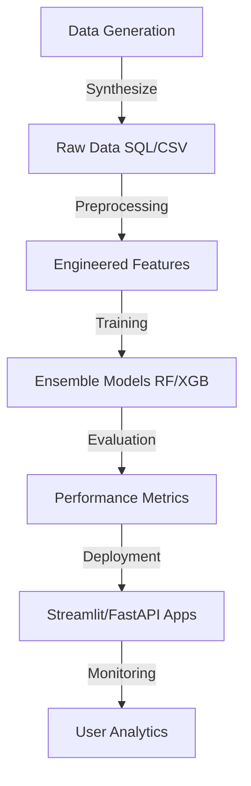

# WEGOGYM

An advanced, machine-learning-powered gym footfall prediction system designed to optimize gym operations and enhance user experience.

## Project Overview

This project leverages historical data and ensemble learning (Random Forest and XGBoost) to forecast gym attendance based on a variety of features including:

- **Temporal factors**: Date, Day of Week, Month, Hour.
- **Academic factors**: Exam phases (Midterm/Endterm), Academic Load/Stress Levels.
- **Environmental factors**: Weather conditions (Rain, Heat, Cold), Gym Maintenance schedules.
- **Population data**: Active student population and adoption ratios.

The system features two primary interfaces:

1. **Streamlit Dashboard**: A high-end, interactive analytical tool for staff and management.
2. **FastAPI Backend + Web UI**: A lightweight API-driven interface with a modern frontend.

---

## Repository Structure

```text
.
├── dashboard_fastapi/       # FastAPI Backend & Web UI
│   ├── main.py              # API Entry point
│   └── static/              # HTML/JS/CSS Frontend
├── dashboard_streamlit/     # Streamlit Analytics Dashboard
│   ├── main.py              # Dashboard Entry point
│   └── generate_data.py     # Local data generation utility
├── data/                    # Dataset storage (CSV/DB - ignored by git)
├── models/                  # ML Models & Metadata
│   └── metadata.json        # Detailed model performance and feature info
├── scripts/                 # Training & Preprocessing scripts
│   ├── train_random_forest.py
│   ├── train_xgboost.py
│   └── data_cleaning_preprocessing.py
├── requirements.txt         # Project dependencies
└── .gitignore               # Standard ignores + Binary data exclusion
```

---

## Getting Started

### 1. Installation

Clone the repository and install dependencies:

```bash
pip install -r requirements.txt
```

### 2. Data & Models
>
> [!NOTE]
> Database files (`.db`, `.csv`) and model binaries (`.pkl`) are excluded from this repository to maintain a clean environment.

To set up the environment:

1. Run `python dashboard_streamlit/generate_data.py` to create the synthetic dataset.
2. Run scripts in `scripts/` to train the models and save them to the `models/` directory.
3. Refer to `models/metadata.json` for the expected model performance and architectural details.

### 3. Running the Applications

#### Streamlit Dashboard

```bash
streamlit run dashboard_streamlit/main.py
```

#### FastAPI Backend

```bash
uvicorn dashboard_fastapi.main:app --reload
```

View the web interface at `http://127.0.0.1:8000`.

---

## Model Methodology

We compare three distinct approaches:

- **Baseline (Logistic Regression)**: A simple linear approach to establish a performance floor.
- **Random Forest**: An ensemble of 100+ decision trees capturing complex non-linear interactions.
- **XGBoost**: Gradient boosted trees optimized for high precision in hourly forecasting.

Detailed metrics and feature importances can be found in [models/metadata.json](models/metadata.json).

---

## ML Pipeline

The project follows a structured machine learning pipeline to ensure data consistency and model reliability:



1. **Generation & Collection**: Synthetic gym data is generated to simulate complex real-world patterns like holiday shifts and weather impacts.
2. **Preprocessing & Engineering**: Scripts automate data cleaning, temporal feature extraction (sine/cosine transformations), and categorical encoding.
3. **Training & Validation**: Multi-model training approach using Random Forest and XGBoost with hyperparameter tuning.
4. **Serving**: Reliable prediction APIs and interactive dashboards for end-user accessibility.

---

## Design Aesthetics

The dashboards are designed with a **premium dark-mode aesthetic**, utilizing glassmorphism, dynamic Plotly visualizations, and responsive layouts to provide a professional user experience.

---

## License

This project is licensed under the MIT License - see the [LICENSE](LICENSE) file for details.
